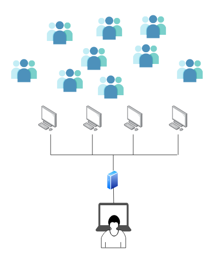

# Network Orchestra
## Quadrophonic Performance

A quadrophonic performance using computers as speakers.  

## About
This is quadrophonic speaker performance where personal computers are used as speakers. The signals are sent from a performer using master computer that sends network traffic information to a WebSocket Server which are delivered to connected clients. The server is optimized for four clients, but potentially can be scaled much higher.

## Setup & Installation
- Clone the respository
- Begin the WebServer with `npm start`
- Use a modern web browser and connect to `localhost:8000` (This will be the master computer)
- Connect 4 clients to the same network
- In a modern web browser connect client machines to `<serverIpAddress>:8000`
- Browse the internet using the Master computer

## Software used
- Node/Express
- SocketIO
- ToneJS
